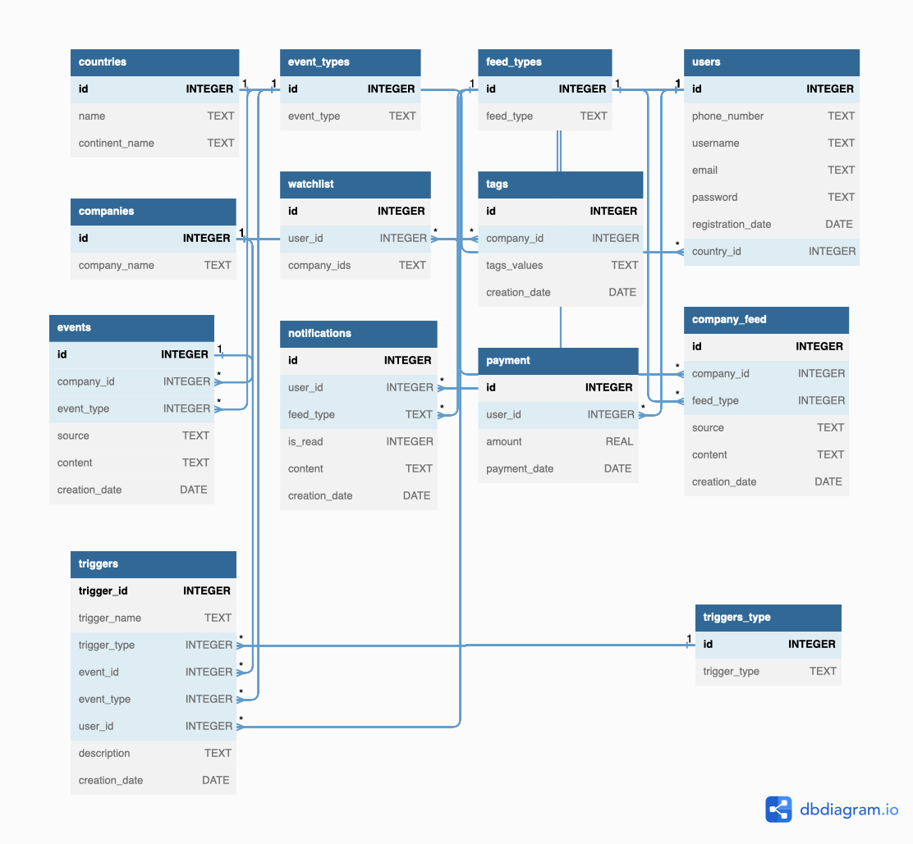

# Repo for MIPT Hackathon 2023

Database file: wale.sqlite.

SQL DDL: init_db.sql.

https://dbdiagram.io/d/6489fdb8722eb77494f83f6d

## Связи между таблицами

1. Таблица 'countries' содержит информацию о разных странах. Она имеет связь один-ко-многим с таблицей 'users', где столбец 'country_id' в таблице 'users' ссылается на столбец 'id' в таблице 'countries'.

2. Таблица 'event_types' перечисляет различные типы событий. Эта таблица используется в качестве ссылки для столбца 'event_type' в таблице 'events', создавая связь один-ко-многим.

3. Таблица 'feed_types' определяет различные типы активностей, такие как комментарии, лайки, шеринг и отчеты. Столбец 'feed_type' в таблицах 'company_feed' и 'notifications' ссылается на эту таблицу, устанавливая связь один-ко-многим.

4. Таблица 'users' содержит информацию о пользователях, включая страну проживания. Столбец 'country_id' в таблице 'users' ссылается на столбец 'id' в таблице 'countries', создавая связь один-ко-многим между пользователями и странами.

5. Таблица 'companies' содержит информацию о различных компаниях. Столбец 'company_id' в таблицах 'tags', 'company_feed', 'events' и 'triggers' ссылается на столбец 'id' в таблице 'companies', создавая связь один-ко-многим.

6. Таблица 'watchlist' позволяет пользователям создавать список компаний, которые их интересуют. Столбец 'user_id' в таблице 'watchlist' ссылается на столбец 'id' в таблице 'users', устанавливая связь один-ко-многим.

7. Таблица 'tags' хранит теги, связанные с каждой компанией. Столбец 'company_id' в таблице 'tags' ссылается на столбец 'id' в таблице 'companies', создавая связь один-ко-многим.

8. Таблица 'company_feed' содержит новости, связанные с компаниями. Столбец 'company_id' в таблице 'company_feed' ссылается на столбец 'id' в таблице 'companies', устанавливая связь один-ко-многим.

9. Таблица 'events' хранит события, связанные с компаниями. Столбец 'company_id' в таблице 'events' ссылается на столбец 'id' в таблице 'companies', создавая связь один-ко-многим. Кроме того, столбец 'event_type' ссылается на таблицу 'event_types'.

10. Таблица 'notifications' содержит информацию о уведомлениях для пользователей. Столбец 'user_id' в таблице 'notifications' ссылается на столбец 'id' в таблице 'users', устанавливая связь один-ко-многим. Столбец 'feed_type' ссылается на таблицу 'feed_types'.

11. Таблица 'payment' хранит данные о платежах, совершенных пользователями. Столбец 'user_id' в таблице 'payment' ссылается на столбец 'id' в таблице 'users', создавая связь один-ко-многим.

12. Таблица 'triggers_type' определяет различные типы триггеров, такие как ежечасные, ежедневные, ежемесячные и ежегодные. Столбец 'trigger_type' в таблице 'triggers' ссылается на эту таблицу, устанавливая связь один-ко-многим.

13. Таблица 'triggers' хранит информацию о триггерах. Она имеет связи с несколькими таблицами, включая 'events', 'users', 'triggers_type' и 'companies'. Столбец 'event_id' ссылается на столбец 'id' в таблице 'events', 'user_id' ссылается на столбец 'id' в таблице 'users', 'trigger_type' ссылается на таблицу 'triggers_type', а 'event_type' ссылается на таблицу 'event_types'.

Эти связи обеспечивают целостность данных и позволяют извлекать и обрабатывать информацию из нескольких таблиц структурированным образом.
